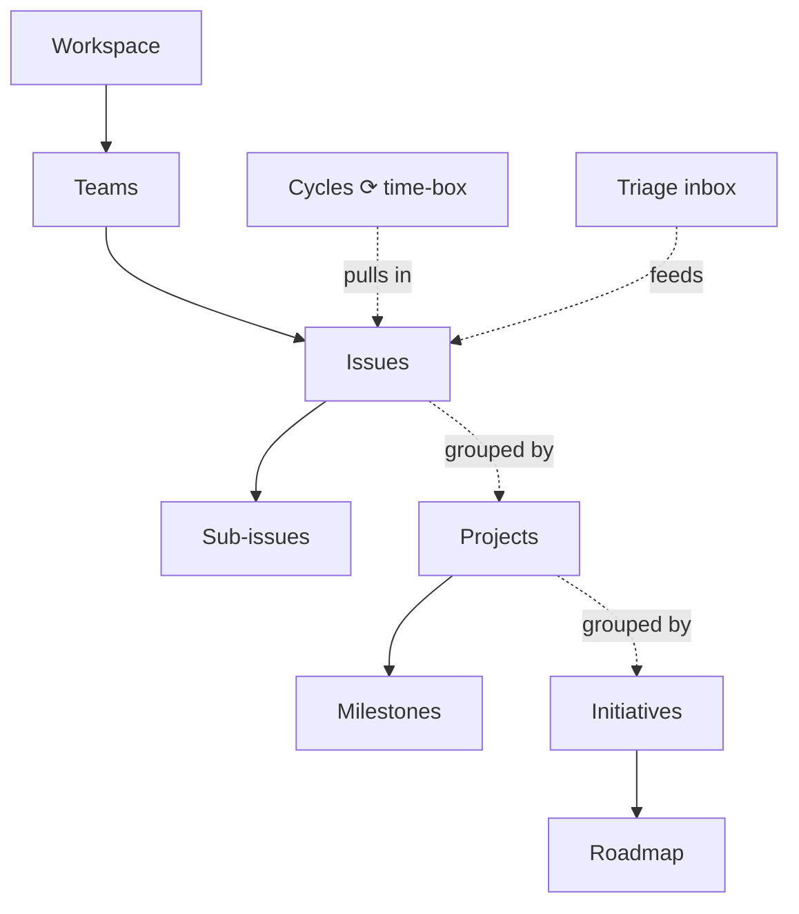
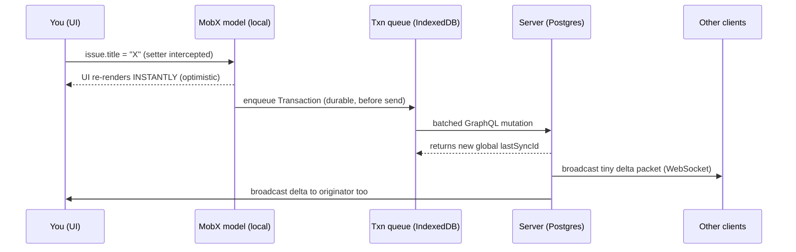

# Linear — A Deep Study

**Lens:** what a solo builder of **ac-rubicon** (a phone-first daily/weekly planner) can steal from Linear.
**Date:** 2026-06-17 · **Method:** 4 parallel research agents (architecture, method, design, business) + live walkthrough of the real app via Cole's Personal browser.

> Linear is the most-copied productivity product of the last five years. It went from waitlist (2019) to **~$100M ARR and a $1.25B valuation (June 2025) with ~100 people and ~$35K of lifetime paid marketing.** It did this with one strategy: **quality is the moat.** Everything below is how that strategy shows up in the philosophy, the product model, the code, and the pixels — and what to copy into ac-rubicon.

---

## 0. TL;DR — the 12 things to steal

1. **Be opinionated, not configurable.** One excellent default way to plan a day beats 40 settings. Flexibility = decision fatigue.
2. **Speed is the feature.** Optimistic UI + no spinners + instant boot is ~80% of why Linear "feels premium" — and you can get it without their sync engine.
3. **The week is a Cycle.** Auto-repeating, with **auto-rollover** of unfinished tasks and a **capacity warning** from your last ~3 weeks' velocity.
4. **Triage everything before it hits "Today."** A 4-action inbox (Accept / Decline / Merge / Snooze) keeps the active list clean.
5. **Make "snooze / push to tomorrow" a one-gesture verb.** It's the single most-used mobile action in a planner.
6. **Ladder every task up to a "why"** (Task → Project → Goal), and roll a 3-state health (on track / at risk / off track) back up at weekly recap.
7. **Steal the LCH/OKLCH theme system:** define the whole palette from 3 variables (base, accent, contrast) → free dark mode + free accessible high-contrast.
8. **Cool-gray monochrome + ONE accent, rationed to the single primary action per screen.** Color = meaning, never decoration.
9. **Bottom toolbar in the thumb zone + a persistent "add" button on every screen.** That's the mobile translation of Linear's keyboard-first model.
10. **Write tasks like Linear writes issues:** short, plain-language, one concrete outcome. Ideas go to notes, not the task list.
11. **A weekly "what I shipped" log** (auto-generated from completed tasks) = your personal changelog. Huge motivational ROI.
12. **Decide by taste + your own daily usage, not dashboards.** You're the user; that's the highest-signal feedback loop you'll ever have.

The rest of this doc is the *why* behind each.

---

## 1. What Linear is & why it's worth studying

Linear is an issue-tracking / product-planning tool for software teams — positioned as the **anti-Jira**: where Jira is infinitely customizable, Linear is **deliberately constrained and opinionated**. Its insight: *endless customization is the pain, not the value.*

It matters to ac-rubicon for three reasons:
- **Same job, different scale.** Linear turns "a pile of work + a team + time" into momentum. ac-rubicon turns "a pile of intentions + one person + a day" into momentum. The primitives rhyme.
- **It is the reference for craft.** If you're competing on feeling-better-than-the-bloated-incumbents (and a phone-first planner is), Linear is the textbook.
- **It's phone-relevant now.** Linear shipped mobile (2024) and fully redesigned it (Oct 2025) — a clean case study in translating desktop craft to touch.

---

## 2. The strategy — craft as a moat

### The people & the origin
Three Finnish founders, all senior ICs (not managers) before Linear:
- **Karri Saarinen** (CEO/design) — Principal Designer & design-system co-creator at **Airbnb**; founding designer at Coinbase.
- **Tuomas Artman** (CTO) — staff engineer on **Uber's** mobile platform; had built sync engines for ~a decade.
- **Jori Lallo** (eng) — senior engineer at **Coinbase**.

They'd previously co-founded **Kippt** (YC 2012 → acquired by Coinbase 2014). The original insight (2018): *issue trackers are built for managers, not the people doing the work,* and even elite companies lacked a consistent method for building software. Pre-signal: at Airbnb, Karri's Chrome extension that "simplified Jira" was adopted by ~100 people on the product team.

### Traction & funding
| Round | Date | Amount | Valuation | Notes |
|---|---|---|---|---|
| Seed | Nov 2019 | $4.2M | — | Sequoia DM'd them ~2 days after the public Twitter announce; they weren't even raising |
| Series A | Dec 2020 | $13M | — | Team still < 30 |
| Series B | Sep 2023 | $35M | — | ~50 people, **already profitable** |
| Series C | Jun 2025 | $82M | **$1.25B** | ~100 people; OpenAI, Ramp, Vercel, Perplexity, Cash App, Mercury as customers |

Profitable ~1 year after public launch (2021), with **negative lifetime burn** (more cash than they raised). ARR est. ~$8.4M (2023) → ~$100M (2025) *(third-party estimate; Linear doesn't disclose).* **~$35K lifetime paid marketing.**

### The thesis, in their words
- *"We started with quality. Then we learned that people actually noticed, because it's a rare approach — especially for startups."* — Karri
- *"Quality is our first principle. Every other metric and decision flows from that."*
- *"We've set out to be profitable so that we have the freedom to do things in a high-quality way."*
- Sequoia called Linear *"almost a Veblen good for developers"* — using it became a **status/identity signal** and even a recruiting tool.

Their marketing *is* their craft: the public **Linear Method**, the engineering blog, founder Twitter, and the changelog. They explicitly avoided SEO/growth hacks and grew by **word of mouth + build-in-public + launching many times** (they "launched" 5 times — company, beta, public, Series A, evolution).

### → For ac-rubicon
- **Craft is your only viable wedge.** You can't out-feature incumbents; you can out-*feel* them. Make ac-rubicon conspicuously faster, more polished, more considered — and make that the story.
- **You are the dogfood.** Linear had to manufacture a beta cohort; you *are* the target user (night-owl, evening deep work, gym 4–8pm). That's a cheat code — use your own daily usage as the feedback loop.
- **Stay small & let profitability buy freedom.** Linear's deepest bet: fewer people build better. For you that's permission, not constraint.
- **Build in public, launch repeatedly.** Each milestone (waitlist → beta → v1 → each marquee feature) is a separate launch. One launch wastes a year of momentum.
- **Design the screenshot-able surfaces.** A phone planner lives on a screen people show others. A beautiful "today" view or a completed-day summary is free distribution — Linear's "Veblen good" effect, applied to a planner.

---

## 3. The Linear Method — their operating philosophy

Linear publishes its beliefs at `linear.app/method`. It's split into **Principles** (the why) and **Practices** (Direction + Building). The ones that transfer:

### Principles
- **Build for the creators** — serve the person doing the work, not the observer/reporter.
- **Opinionated, not flexible** — *"We design it so there's one really good way of doing things. Flexible software lets everyone invent their own workflows, which eventually creates chaos."*
- **Create momentum, don't sprint** — a sustainable repeating cadence beats deadline crunches.
- **Aim for clarity** — *"Don't invent terms if possible."* Plain language (teams, projects, issues).
- **Say no to busy work** — the tool works for you; automate the overhead (date math, rollover, status bookkeeping).
- **Decide and move on** — *"Do it today instead of tomorrow and this week instead of next week… find a way to act instead"* of staying paralyzed.

### Practices that matter for a planner
- **Scope down (1–3 weeks / 1–3 people).** *"If there's no way to scope down, break it into stages."* Their own Cycles & Projects features each took ~2 weeks.
- **Write issues, not user stories.** Short, plain, concrete, with a defined outcome. Non-tangible ideas belong in docs, **not** the tracker. *"Write your own issues"* (faster + forces analysis).
- **Enablers vs blockers.** Two buckets: *enablers* add value; *blockers* remove friction. Bias to what moves the needle *this week*. (This is how they mix feature work with debt/quality work.)
- **Launch & keep launching; build in public.** Publish a changelog even with few users — it serves you (momentum/reflection), users (proof of progress), and investors.

### → For ac-rubicon
- **Bake in the opinion.** One default loop: **triage → weekly cycle → daily commit → recap**. Resist customization knobs; for a personal tool, "flexibility" = decision fatigue.
- **Task-writing discipline.** Tasks = short, plain, one outcome ("Draft hook for Tuesday video"), not vague projects. Ideas/musings route to a notes surface, keeping the list action-only.
- **Weekly enabler/blocker prompt.** During weekly setup, tag candidate work as *unblocks something* vs *new value* and bias to needle-movers. A two-bucket prompt is enough.
- **Your changelog = a "shipped this week" recap** auto-built from completed tasks (see §6).

---

## 4. The product model — how Linear is organized

### The object hierarchy

- **Issue** — the atom. Needs only **title + status**. Optional: priority, estimate, labels, due date, assignee, project, cycle. *(You saw this live: the COL-1 detail view with the Status → Priority → Assignee → Labels → Project rail.)*
- **Workflow states** — 6 fixed categories (Backlog, Todo, In Progress, Done, Canceled, Triage); statuses inside are customizable but the **categories are not** — anti-bloat by design.
- **Priorities** — exactly 5 (None, Urgent, High, Medium, Low). Deliberately not customizable: *"it's easy to get carried away with specificity."* Un-prioritized always sorts last.
- **Projects** — units of work with a clear outcome + dates, a lead, a spec doc, a progress graph; can span teams. One issue → at most one project.
- **Initiatives** — curated groups of projects = the org's goals; roll up a **health** signal (on track / at risk / off track).
- **Cycles** — the time layer (next section).
- **Triage** — the intake gate (below).

### Cycles (the signature mechanic)
- Time-boxed, **automated, repeating** periods (1–8 wks). **Explicitly NOT tied to a release** — that's the deliberate difference from scrum sprints.
- **Auto-rollover:** *"Any unfinished work rolls over to the next cycle automatically. There is no way to keep unfinished issues in a closed cycle."* Nothing is lost or stranded.
- **Capacity dial** estimates likelihood of completion from the **velocity of the last 3 cycles**.
- **Cooldown** — optional break between cycles for debt, planning, rest.

### Triage (the intake gate)
A special team inbox where incoming items land **before** entering the workflow. Four actions:
- **Accept** (`1`) → into the default status
- **Mark Duplicate** (`2`) → merge into an existing issue
- **Decline** (`3`) → cancel with optional comment
- **Snooze** (`H`) → hide until a chosen time or new activity

### → For ac-rubicon (the highest-value section)
This maps almost 1:1 onto a personal planner:

| Linear | ac-rubicon |
|---|---|
| **Cycle (auto-repeating)** | **The week** — fixed 1-week cycle, auto-created, no date math |
| **Auto-rollover** | Unfinished tasks **auto-carry** into next week (kills the guilt-ridden re-copy ritual) — *the single most useful behavior to copy* |
| **Capacity dial** | "You're over-committed" warning from your rolling ~3-week completion average |
| **Cooldown** | A deliberate light/admin day (weekend) for reading + content batching |
| **Triage inbox** | New Notion tasks, calendar invites, quick-captures land in an **inbox**, not on Today. Daily 4-action pass: schedule / drop / merge / snooze |
| **Issue → Project → Initiative** | **Task → Notion project → Goal/Life-area** (Health, Grow channel, Ship ac-rubicon) so every task ladders up to a visible "why" |
| **Project health** | 3-state health per goal at weekly recap, rolled up |
| **5 fixed priorities / 6 fixed statuses** | Keep the schema **small & fixed** (e.g. statuses: Backlog → Today → Doing → Done). Use labels for the rest |
| **T-shirt estimates → capacity** | Optional S/M/L sizing; "L = split this task" |
| **Cycle calendar (.ics)** | GCal two-way: time-block tasks against real events; the tool does the date math |

---

## 5. The architecture — the Linear Sync Engine (LSE)

This is the "how it's built" core. **Confidence note:** the deepest mechanism detail comes from reverse-engineering write-ups **endorsed by Linear's CTO** (wzhudev / backupManager repos) + the performance.dev breakdown + Artman's talks. Treated as near-primary.

### The one-sentence model
> **The database lives in the browser.** The full (permissioned) workspace is synced to the client (IndexedDB), held in memory as a reactive object graph (MobX), and **mutated locally-first**; the server is a **sync target, not the source of truth for the UI**. *"There are no spinners because there is nothing to wait for."*

A co-founder: *"Literally the first lines of code I wrote was the sync engine."* Lineage: Uber's open-sourced "Jetstream" protocol.

### The write path (what happens when you change a field)

Key mechanisms:
- **Global monotonic `lastSyncId`** — every server transaction increments one global integer. It's the DB version; clients compare local vs server to detect drift. This gives **total ordering** via a central authority (closer to OT than CRDT).
- **Transactions** (Create/Update/Delete/Archive/Unarchive) are written to a `__transactions` store in IndexedDB **before** execution → offline + crash safety. A microtask scheduler **batches** same-tick mutations into one GraphQL request (aliased `o1:`, `o2:`…). On reject → `rollback()`.
- **Delta packets** (read path): tiny JSON envelopes `{id, action, modelName, modelId, data}` over WebSocket. **Cost of updates scales with what changed, not what's on screen.** Catch-up after offline via `GET /sync/delta?lastSyncId=…`.
- **Conflict strategy = naive Last-Write-Wins, server-authoritative.** No OT, no CRDT for the general case — *conflicts are rare in issue tracking.* CRDTs used **only** for collaborative rich-text (issue descriptions).
- **Load strategies:** `instant` (loaded at bootstrap) / `lazy` / `partial` / `local`. Plus precomputed **"partial indexes"** so lazy models can be queried without IDs. Net effect: *"a 10,000-issue workspace boots about as fast as a 100-issue one."*
- **Granular reactivity:** every field is its own MobX observable; components wrapped in `observer()`. *"A 50-issue update is 50 cell re-renders, not a full list re-render."*

### The stack (publicly known)
- **TypeScript on client AND server** (Node). **PostgreSQL.** **GraphQL** (mutations + queries) + **WebSocket** deltas + webhooks. **GCP / Kubernetes.**
- **Desktop = Electron** wrapping the same React web app. **Web = CSR PWA** with a service worker precaching ~1,200 assets (offline + instant reloads).
- Deliberately **"boring" stack** so any engineer owns a feature end-to-end; the *one* exotic piece is the sync engine.
- *(Myth-busting: "Go backend" and "Vue frontend" appear in some summaries — both wrong. Go = Artman's Uber past; the app is React/TS.)*

### → For ac-rubicon (what to copy, what to skip)
- **Do NOT build LSE from scratch.** Even a basic version is "months of engineering." If you want local-first later, adopt **Zero / ElectricSQL / PowerSync / Replicache** (all Postgres-friendly — fits your Supabase stack).
- **Copy the cheap 80%:** **optimistic writes on every mutation** (toggle done, reschedule, edit) with no spinners. In Next.js: React `useOptimistic` + a cached store. This is where almost all the "feels instant" comes from.
- **A durable, replayable mutation queue** (IndexedDB) gives you offline + crash-safety + reconnect for free — high value on flaky phone networks.
- **Single global version counter + LWW is the 80/20 of correctness.** A personal planner is effectively single-user across phone+desktop → conflicts are near-zero → **skip CRDTs entirely.**
- **Send deltas, not snapshots;** a plain WebSocket pushing `{action, id, data}` is the whole real-time story (no GraphQL subscriptions needed).
- **Perceived perf = many small disciplines:** inline a themed app shell + restore prefs from `localStorage` before JS parses; service-worker precache; route-level code-split; render-first-authenticate-second; command/search reads the local store, not the network.

---

## 6. Design & UX craft — why it feels premium

### Speed is a *design* problem too
Beyond the engine: **optimistic UI, no spinners, instant boot from cached state, prefetching.** And speed is also an **input-model** problem — *"if the fastest path to an action requires a mouse, three menus, and a click, the user pays for those steps regardless of how fast the engine runs."* Measured: issue updates in **~milliseconds vs ~300ms** for a traditional CRUD app.

### The command menu (⌘K) — their most iconic pattern
*(You saw it live.)* It searches the **local object pool — no server request**, so it's instant; fuzzy; and crucially it **displays the keyboard-shortcut hint next to each action** (`C`, `V`, `N then P`) so it *teaches* shortcuts as you use it. Multiple paths to every action (button / shortcut / right-click / command bar) → discoverability **and** muscle memory. "Ask Linear" (AI) is docked in the same bar.

### Visual language
- **Type:** one family — **Inter** (+ Inter Display for headings). Systemic scale/weight/spacing; no decorative fonts.
- **Color = meaning, not decoration:** cool-gray monochrome + a single accent **rationed to one primary action per screen** (red=danger, green=success).
- **Density:** "instrument-panel" density; cards earn presence via **1px inset borders + soft shadows, not fills**; the whole surface stack lives in a **~4-step elevation range**.
- **Dark theme done right:** never pure `#000` — base dark surfaces on the brand hue at ~1–10% lightness. *(You saw this on the mobile + Plan pages, including the signature film-grain.)*

### The LCH color system (their most copyable artifact)
They migrated HSL → **LCH** because it's **perceptually uniform** (a red and a yellow at lightness 50 *look* equally light). The payoff: **themes are defined by just 3 variables — base, accent, contrast** — instead of ~98 per theme; the system derives all surfaces/states, and the contrast variable **auto-generates accessible high-contrast themes.** Karri: *"There is no design system team, no councils… we have a system which has colors, type, icons and components."*

### Motion & "invisible details"
- Animate **only `transform`/`opacity`** (GPU, no layout); **never** `width/height/margin/padding`.
- **100–150ms**, **asymmetric** (instant in, ~150ms fade out), **no per-row list animations** (keeps lists snappy), and **scale-from-origin** (a popover grows from the pill it belongs to).
- The archetype "invisible detail": a **submenu safe-area triangle** computed between cursor and submenu so diagonal movement doesn't close it. *"One small thing you won't see but will hopefully feel."*

### Mobile — translating craft to touch (most relevant to ac-rubicon)
Shipped Sep 2024, fully redesigned Oct 2025. **Native Swift + Kotlin** (not a web wrapper) "to guarantee a fast, fluid experience."
- **Positioning:** *"The portable companion to the Linear system. Complex workflows in compact form."* / *"Built for 'away from keyboard' activities… a powerful sidekick, always available in your pocket."* — it does **not** replicate the desktop. *(Both seen live.)*
- **Input model swap:** keyboard shortcuts → **gestures** (*"Tap to take action, swipe to delete, snooze to deal with it later"*) + **bottom toolbar** (thumb zone) + a **persistent "Create Issue" button on every screen** (the mobile equivalent of the always-available `C`).
- **Snooze is first-class.** **Screenshot-to-triage** in a few taps. **"Ergonomic, palm-perfect."** New **frosted-glass** material for depth. Notification **schedule** to protect focus.

### → For ac-rubicon — phone-first patterns to steal
1. **Optimistic UI everywhere, zero spinners** (biggest "premium" lever).
2. **Instant boot from cached state** — a planner opened 10×/day must never show a loading screen.
3. **Persistent primary action** (one-tap quick-capture) on every screen.
4. **Bottom toolbar in the thumb zone** for your 3–5 core views (Today / Plan / Inbox…).
5. **Consistent swipe/tap/long-press gestures** meaning the same thing everywhere (swipe-right = complete, swipe-left = snooze).
6. **Snooze / "push to tomorrow" = one gesture**, never buried.
7. **LCH/OKLCH 3-variable theme** (base + accent + contrast) → free dark mode + free accessible high-contrast. Tailwind v4 supports OKLCH natively.
8. **Cool-gray monochrome + one accent** = the cheapest way to look premium. Keep **one** signature element so you don't dissolve into the "Linear-style" sameness.
9. **Motion:** `transform`/`opacity` only, 100–150ms, scale-from-origin, asymmetric — buttery on phones, cheap to build.
10. **Pick 1–2 "invisible details" and over-polish them** — generous hit targets, a satisfying haptic + micro-animation on task-complete.
11. **A command palette still works on mobile** as a "do anything / jump anywhere" sheet behind the persistent button.
12. **Native-feel on web:** kill tap delay, use `touch-action`/`overscroll-behavior`, hardware-accelerated transitions, skeletons over spinners.

---

## 7. The ac-rubicon playbook — prioritized

**Copy now (cheap, high impact):**
- Optimistic UI + no spinners + instant boot from cache.
- Bottom thumb-zone toolbar + persistent one-tap capture.
- Swipe-to-complete / swipe-to-snooze; snooze as a first-class verb.
- OKLCH 3-variable theme (free dark + accessible contrast).
- Monochrome + single accent; motion discipline (transform/opacity, 100–150ms).
- Task-writing discipline (short, one outcome; ideas → notes).

**Build soon (the core loop):**
- **The week as an auto-repeating Cycle with auto-rollover** of unfinished tasks. *(Start here — it's the soul of the whole system.)*
- **Triage inbox** (Accept / Drop / Merge / Snooze) between capture/Notion/GCal and Today.
- **Task → Project → Goal ladder** with a visible "why," + 3-state goal health at weekly recap.
- Capacity warning from rolling 3-week velocity; optional S/M/L sizing.
- Weekly **"shipped this week"** recap (your changelog).

**Later / optional:**
- Local-first via an off-the-shelf sync engine (Zero/Electric/PowerSync) — only if/when offline + cross-device speed becomes the bottleneck. Take the local-first/optimistic half; skip multiplayer conflict machinery.
- A mobile command palette.
- Cooldown days; cycle boundaries in GCal.

**Operating posture (from the company study):**
- Be the dogfood; decide by taste + your own usage, not dashboards.
- Reduce scope to raise quality; say no aggressively.
- Build in public; treat each milestone as a launch.

---

## 8. Screenshots captured (reference)

Captured live from Cole's Personal browser (see chat transcript for the images):
1. **Active Issues list** (real workspace, light) — sidebar nav, grouped list, the default onboarding issues.
2. **Command menu (⌘K)** (light) — shortcut hints beside actions + "Ask Linear."
3. **Issue detail (COL-1)** (light) — title + rich body, the Status/Priority/Assignee/Labels/Project rail, `1/4` keyboard pager.
4. **Mobile Inbox hero** (dark) — "The portable companion… Complex workflows in compact form."
5. **Mobile composer** (dark) — "Built for 'away from keyboard' activities… a powerful sidekick in your pocket."
6. **Plan page hero** (dark) — "Plan and navigate from idea to launch"; signature film-grain dark aesthetic.

---

## 9. Sources

**Architecture:** wzhudev & backupManager *reverse-linear-sync-engine* (GitHub, CTO-endorsed) · performance.dev "How is Linear so fast" · Artman "Scaling the Linear Sync Engine" (linear.app/now) · localfirst.fm #15 · marknotfound.com · linear.app/developers/graphql
**Method/product:** linear.app/method (+ subpages) · linear.app/docs (conceptual-model, use-cycles, triage, projects, initiatives, priority, estimates) · lennysnewsletter.com "How Linear builds product"
**Design:** linear.app/now/how-we-redesigned-the-linear-ui · linear.app/mobile · linear.app/changelog/2025-10-16-mobile-app-redesign · medium.com/linear-app "Invisible details" · figma.com/blog Karri's 10 rules
**Business:** newsletter.pragmaticengineer.com/p/linear · review.firstround.com "Linear's path to PMF" · sequoiacap.com/article/linear-spotlight · linear.app/now/building-our-way (+ series-b) · techcrunch.com (Series C, $82M/$1.25B) · research.contrary.com/company/linear
